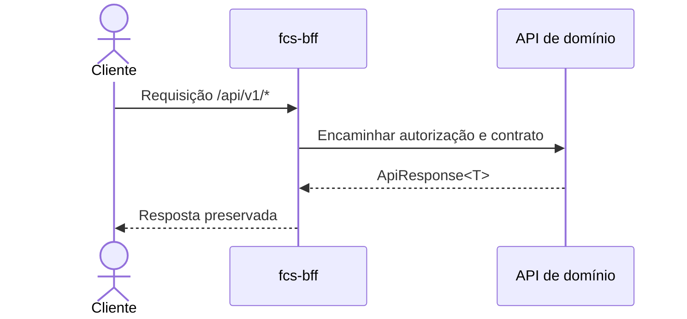

# fcs-bff

Backend for Frontend da plataforma **Conexão Solidária**. O serviço atua como fachada HTTP para o `fcs-web`, encaminhando chamadas para `fcs-identity`, `fcs-campaign` e `fcs-donations`.

> Serviço que compõe o MVP da Conexão Solidária junto a `fcs-identity`, `fcs-campaign`, `fcs-donations`, `fcs-donation-worker`, `fcs-audit-logs`, `fcs-web`, `fcs-infra` e `fcs-pipelines`.

---

## Responsabilidades

- Centralizar a base pública consumida pelos frontends.
- Encaminhar autenticação, cadastro, perfil, campanhas, transparência e doações para as APIs de domínio.
- Preservar `Authorization`, `Cookie`, `Set-Cookie`, `X-Correlation-ID`, status codes e response bodies dos downstreams.
- Adaptar rotas de conveniência do frontend, como `PATCH /api/v1/campaigns/{id}/complete` e `PATCH /api/v1/campaigns/{id}/cancel`.
- Expor `/health` e `/metrics` do próprio BFF.

O BFF **não** é dono de domínio, banco, Kafka, sessão ou RBAC. A validação de JWT e a autorização continuam nas APIs de domínio.

Documentação completa da arquitetura: [group10-tc-01/fcs-fase05-docs](https://github.com/group10-tc-01/fcs-fase05-docs).

Referências diretas:

- [Visão geral da arquitetura](https://github.com/group10-tc-01/fcs-fase05-docs/blob/main/architecture/overview.md)
- [Fluxos de endpoints](https://github.com/group10-tc-01/fcs-fase05-docs/blob/main/architecture/endpoint-flows.md)
- [Repositórios e infraestrutura](https://github.com/group10-tc-01/fcs-fase05-docs/blob/main/architecture/repositories-and-infra.md)
- [Plataforma e borda pública](https://github.com/group10-tc-01/fcs-fase05-docs/blob/main/architecture/overview.md)

---

## Estrutura do projeto

```text
src/
  Fcs.Bff.WebApi/                 # Controllers proxy, settings, observabilidade e pipeline HTTP
tests/
  Fcs.Bff.UnitTests/              # Testes de regras auxiliares do proxy
  Fcs.Bff.IntegratedTests/        # Testes HTTP do BFF com TestServer
```

---

## Endpoints



Caminho-base público versionado: `/api/v1`.

| Método | Rota | Downstream |
| --- | --- | --- |
| POST | `/api/v1/auth/register/donor` | `fcs-identity` |
| POST | `/api/v1/auth/login` | `fcs-identity` |
| POST | `/api/v1/auth/refresh` | `fcs-identity` |
| POST | `/api/v1/auth/logout` | `fcs-identity` |
| GET | `/api/v1/me` | `fcs-identity` |
| GET | `/api/v1/transparency/campaigns` | `fcs-campaign` |
| GET | `/api/v1/campaigns` | `fcs-campaign` |
| GET | `/api/v1/campaigns/active` | `fcs-campaign` transparency |
| GET | `/api/v1/campaigns/{id}` | `fcs-campaign` |
| POST | `/api/v1/campaigns` | `fcs-campaign` |
| PUT | `/api/v1/campaigns/{id}` | `fcs-campaign` |
| PATCH | `/api/v1/campaigns/{id}/status` | `fcs-campaign` |
| PATCH | `/api/v1/campaigns/{id}/complete` | `fcs-campaign` status `Completed` |
| PATCH | `/api/v1/campaigns/{id}/cancel` | `fcs-campaign` status `Canceled` |
| POST | `/api/v1/donations` | `fcs-donations` |
| GET | `/api/v1/donations` | `fcs-donations` |
| GET | `/api/v1/donations/admin` | `fcs-donations` |
| GET | `/api/v1/donations/{id}` | `fcs-donations` |
| GET | `/health` | BFF |
| GET | `/metrics` | BFF |

Rotas internas dos downstreams, `/health` e `/metrics` dos downstreams não são publicadas pelo BFF.

---

## Pré-requisitos

- [.NET 10 SDK](https://dotnet.microsoft.com/download)
- [Docker](https://docs.docker.com/get-docker/) e Docker Compose
- Instâncias locais de `fcs-identity`, `fcs-campaign` e `fcs-donations` para testar o encaminhamento ponta a ponta.

---

## Configuração

`src/Fcs.Bff.WebApi/appsettings.json`:

```json
{
  "DownstreamServices": {
    "IdentityBaseUrl": "http://localhost:5001",
    "CampaignBaseUrl": "http://localhost:5002",
    "DonationsBaseUrl": "http://localhost:5003"
  }
}
```

Em Docker, o perfil `appsettings.Docker.json` usa os nomes dos serviços na rede:

```json
{
  "DownstreamServices": {
    "IdentityBaseUrl": "http://fcs-identity:8080",
    "CampaignBaseUrl": "http://fcs-campaign:8080",
    "DonationsBaseUrl": "http://fcs-donations:8080"
  }
}
```

---

## Subindo o ambiente local

```powershell
dotnet run --project src/Fcs.Bff.WebApi --urls http://localhost:5004
```

Healthcheck:

```powershell
curl http://localhost:5004/health
```

Com Docker:

```powershell
docker compose up --build
```

---

## Testes

```powershell
dotnet test Fcs.Bff.slnx --configuration Release
```

Cobertura atual:

- Testes unitários de headers do proxy.
- Testes integrados de `/health`.
- Testes integrados de encaminhamento de headers/query string.
- Testes integrados de adaptação `complete -> status Completed`.

---

## CI/CD

Os workflows reutilizam `fcs-pipelines`:

- `.github/workflows/branch-name-check.yml`
- `.github/workflows/dotnet-service-ci.yml`
- `.github/workflows/dotnet-service-cd.yml`

O CD é entregue no K3s da VPS por meio dos workflows reutilizáveis e dos manifests do serviço. Variáveis de ambiente e segredos são fornecidos pela plataforma `fcs-infra`.

---

## Observabilidade

- Logs estruturados com **Serilog**, incluindo `X-Correlation-ID` nas requisições encaminhadas.
- **OpenTelemetry** para tracing, métricas HTTP e instrumentação de `HttpClient`.
- Endpoints operacionais:
  - `GET /health`
  - `GET /metrics`

Na VPS, o Traefik publica o BFF com TLS. O `fcs-bff` encaminha apenas os caminhos de negócio; os endpoints internos dos serviços downstream permanecem restritos à rede do Kubernetes. Consulte a [visão geral da arquitetura](https://github.com/group10-tc-01/fcs-fase05-docs/blob/main/architecture/overview.md) para os cenários de falha e a topologia completa.

---

## Kubernetes

O `fcs-bff` é implantado no namespace `fcs-bff` do K3s. Os manifests, recursos de Ingress e a sincronização de segredos são mantidos pelo `fcs-infra`, de acordo com o [ADR 0022 — Namespaces Kubernetes separados por serviço](https://github.com/group10-tc-01/fcs-fase05-docs/blob/main/adr/0022-use-separated-kubernetes-namespaces.md).

O deploy recebe as URLs dos downstreams e as configurações de observabilidade por variáveis de ambiente e segredos da plataforma. A borda pública é provida por Traefik; `fcs-identity`, `fcs-campaign` e `fcs-donations` permanecem como serviços internos.

---

## Banco de dados

O BFF é **stateless**: não possui banco de dados próprio, migrations, outbox ou consumidores Kafka. Dados de identidade, campanhas e doações continuam sob responsabilidade de seus respectivos serviços de domínio.

---

## Como este serviço atende ao hackathon

| Requisito do hackathon | Onde é atendido |
|---|---|
| Fachada para o frontend | Proxy HTTP versionado em `/api/v1` para os serviços de domínio |
| Separação de responsabilidades | O BFF não concentra regras de negócio, RBAC, persistência ou mensageria |
| Segurança e rastreabilidade | Encaminhamento de `Authorization`, cookies e `X-Correlation-ID` |
| Observabilidade | Serilog, OpenTelemetry, `/health` e `/metrics` |
| Entrega em contêiner | `Dockerfile`, `docker-compose.yml` e workflows reutilizáveis em `.github/workflows` |
| Plataforma integrada | Deploy no K3s da VPS, Traefik e recursos mantidos por `fcs-infra` |

Os fluxos de exceção e as responsabilidades detalhadas de cada endpoint permanecem centralizados em [fcs-fase05-docs](https://github.com/group10-tc-01/fcs-fase05-docs/blob/main/architecture/endpoint-flows.md).
